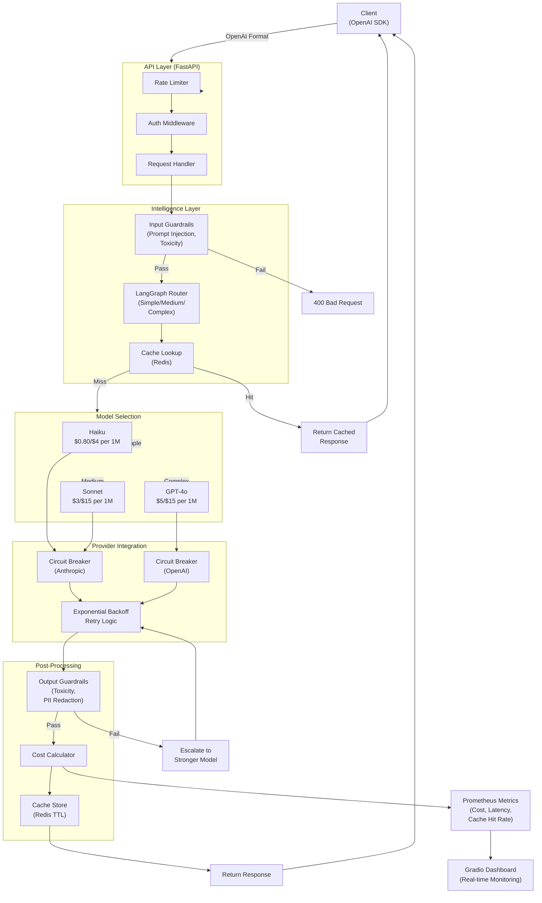

# LLM Cost-Optimization Gateway: Architecture Design Document

## 1. System Overview

The LLM Cost-Optimization Gateway is a production-grade FastAPI proxy that intercepts OpenAI-format chat requests, classifies their complexity using a LangGraph-based router, routes to the optimal model tier, caches responses, applies intelligent guardrails, and tracks real-time cost savings.

**Key Insight:** 80% of requests are simple (basic Q&A, straightforward tasks). Routing these to Haiku instead of GPT-4o yields **25-35% cost savings** while maintaining quality.

---

## 2. System Architecture Diagram



---

## 3. Data Flow: Request to Response

### Step 1: Request Validation & Authentication
```
Client Request (OpenAI format)
  ↓
Rate Limiting (Redis-backed)
  ↓
API Key Validation
  ↓
Parse Request (Pydantic validation)
```

### Step 2: Input Guardrails
```
Extract prompt text
  ↓
Check for prompt injection patterns (regex + ML heuristics)
  ↓
Toxicity filter (using Perspective API or local model)
  ↓
Length validation (max 8K tokens)
  ↓
If BLOCKED → Log + Return 400
If PASS → Continue
```

### Step 3: Complexity Classification (LangGraph)
```
Input: Prompt + conversation history
  ↓
LangGraph Router DAG:
  - Feature extraction (token count, keywords, domain)
  - Decision node: Simple? → Haiku
  - Decision node: Medium? → Sonnet
  - Default: Complex → GPT-4o
  ↓
Output: (model_tier, confidence_score)
```

**Router Decision Logic:**
- **Simple** (Haiku): Basic Q&A, fact lookup, simple summarization, token_count < 500, no reasoning keywords
- **Medium** (Sonnet): Multi-step reasoning, code generation, detailed analysis, token_count 500-2000, presence of "why", "how", "compare"
- **Complex** (GPT-4o): Novel problems, advanced reasoning, multi-domain, token_count > 2000, presence of "novel", "invent", "research"

### Step 4: Cache Lookup
```
Compute cache_key = SHA256(prompt + model_tier + system_message)
  ↓
Redis GET cache_key
  ↓
If HIT (TTL < 1 hour) → Return cached response + skip inference
If MISS → Continue to routing
```

### Step 5: Model Selection & Inference
```
Determine provider (Anthropic or OpenAI)
  ↓
Check circuit breaker status:
  - If OPEN (too many failures) → Fail fast
  - If HALF_OPEN → Try with timeout
  - If CLOSED → Proceed
  ↓
Invoke model with exponential backoff retry:
  - Max 3 retries
  - Backoff: 2s, 4s, 8s
  - Timeout: 30s per attempt
  ↓
If success → Continue
If failure → Try escalated model tier
```

### Step 6: Output Guardrails
```
Extract response text
  ↓
Toxicity filter
  ↓
PII detection + redaction (email, phone, SSN patterns)
  ↓
Confidence score validation (if model provides)
  ↓
If BLOCKED → Escalate to stronger model, retry
If PASS → Continue
```

### Step 7: Cost Tracking & Caching
```
Calculate tokens used (input + output)
  ↓
Look up pricing for (model, tokens)
  ↓
Compare vs. GPT-4o baseline
  ↓
Log cost, savings, model tier to structured log
  ↓
Store response in Redis (TTL = 1 hour)
  ↓
Increment Prometheus metrics
```

### Step 8: Response
```
Return response in OpenAI format
  ↓
Include custom header: X-Model-Tier, X-Cost, X-Cached
  ↓
Client receives response
```

---

## 4. Failure Modes & Recovery

| Failure Mode | Trigger | Recovery Strategy | Outcome |
|---|---|---|---|
| **Redis Down** | Redis connection timeout | Skip caching, proceed to routing (log WARNING) | No cache hit, full inference latency |
| **Provider Rate-Limit** | 429 response | Exponential backoff (2s→4s→8s), then escalate to cheaper provider queue | Delayed response, possible escalation to stronger model |
| **Provider Timeout** | Request > 30s | Retry up to 3 times, then escalate to stronger model | Latency spike, possible cost increase |
| **Guardrail Blocks Response** | Output contains toxicity/PII | Escalate to stronger model (Sonnet→GPT-4o), retry with stricter parameters | Cost increase, possible user notification |
| **All Models Fail** | 3+ failures across tiers | Return 503 Service Unavailable with cached fallback or error message | User sees error, cost not saved |
| **Classification Timeout** | Router > 5s | Default to Medium tier (Sonnet) | Slightly higher cost, guaranteed response |
| **Prompt Injection Detected** | Guardrail detects jailbreak attempt | Block with 400, log incident, alert security team | Request rejected, security maintained |

---

## 5. Tech Stack Justification

| Component | Choice | Rationale |
|---|---|---|
| **Web Framework** | FastAPI | Async-first, excellent performance, built-in validation (Pydantic), OpenAPI docs |
| **Router/Classifier** | LangGraph | Composable, deterministic, easy to debug, integrates with LangChain ecosystem |
| **Caching** | Redis | Ultra-fast, TTL support, atomic operations, production-proven |
| **Retry Logic** | Tenacity | Battle-tested, supports exponential backoff, async-compatible |
| **Logging** | Structlog | Structured JSON logs, integrates with ELK/Datadog, no print() statements |
| **Metrics** | Prometheus | Industry-standard, excellent Grafana integration, low overhead |
| **Dashboard** | Gradio | Fast iteration, professional UI, zero-dependency Python |
| **Testing** | pytest + pytest-asyncio | Async support, excellent fixtures, >80% coverage target |
| **API Clients** | OpenAI SDK + Anthropic SDK | Official, battle-tested, handle retries internally |
| **Containerization** | Docker + docker-compose | Reproducible, Redis included, single-command startup |

---

## 6. Data Structures & Models

### Request Payload (OpenAI-Compatible)
```json
{
  "model": "gpt-4o",  // (ignored, gateway decides)
  "messages": [
    {"role": "user", "content": "What is 2+2?"}
  ],
  "temperature": 0.7,
  "max_tokens": 2048,
  "system_prompt": "You are a helpful assistant."  // (optional)
}
```

### Response Payload (OpenAI-Compatible + Custom Headers)
```
X-Model-Tier: simple
X-Model-Name: claude-3-5-haiku
X-Cost-USD: 0.00012
X-Cost-vs-GPT4o-USD: -0.00048  # savings (negative)
X-Cache-Hit: false
X-Total-Latency-Ms: 850
X-Router-Latency-Ms: 45
```

---

## 7. Deployment & Scalability

### Local Development
- FastAPI server on `localhost:8000`
- Redis on `localhost:6379` (docker-compose)
- Gradio dashboard on `localhost:7860`

### Production (AWS ECS/K8s)
- Horizontal scaling: Multiple FastAPI replicas (auto-scale on CPU/memory)
- Redis Cluster: High availability with replication
- API Gateway: AWS ALB with SSL termination

---

## 8. Success Criteria

✅ All features implemented and tested  
✅ Routing accuracy > 95% on validation set  
✅ Cost savings > 25% on benchmark  
✅ p95 latency < 500ms (simple), < 2s (complex)  
✅ Cache hit rate > 10%  
✅ Guardrail false positive rate < 2%  
✅ Zero data loss on provider failures  
✅ Docker deployment reproducible  
✅ Dashboard functional with live metrics  
✅ >80% test coverage
